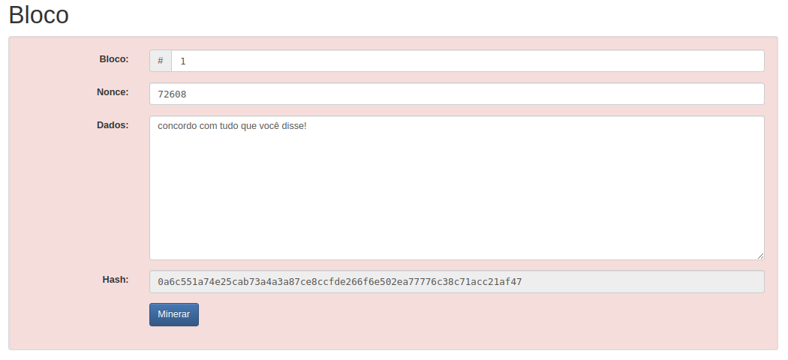
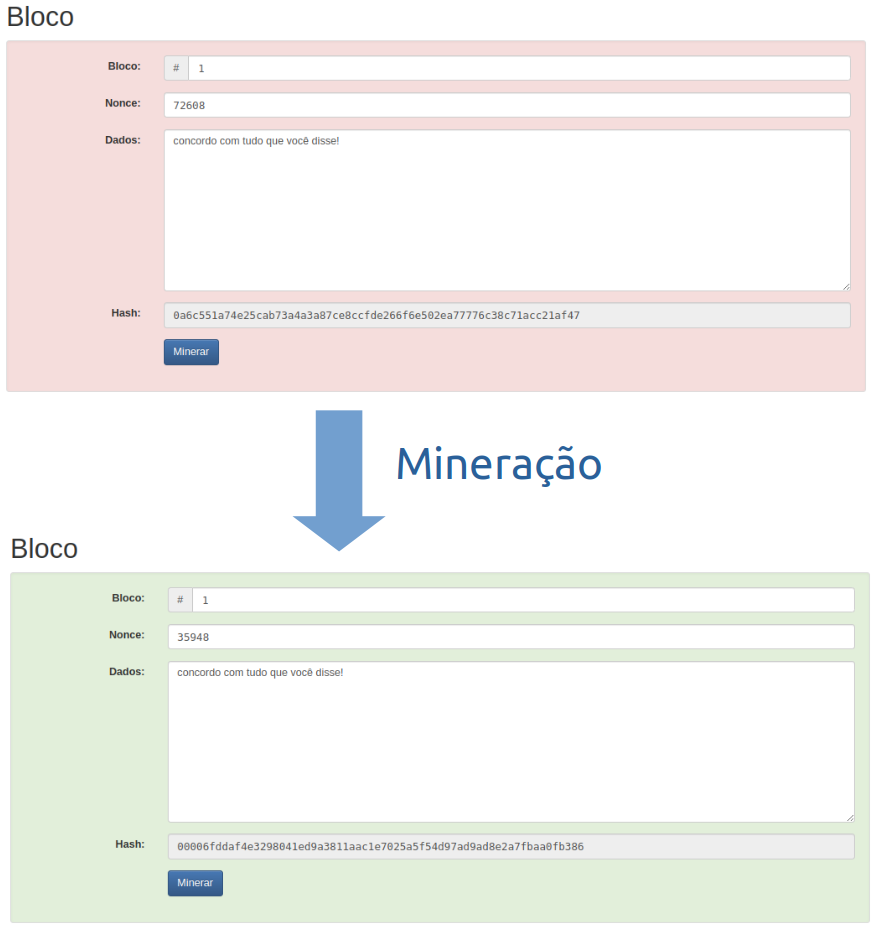
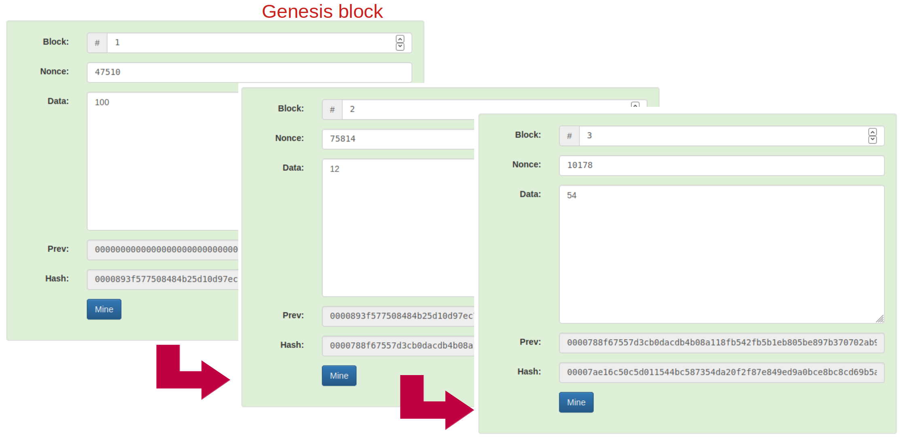

# Inspercoin

## Introdução

No Laboratório de Processos, iremos implementar uma blockchain da nossa própria cryptomoeda: a **Inspercoin**!

Blockchain é uma tecnologia que permite a criação de registros digitais seguros, transparentes e imutáveis. Essa tecnologia funciona como um livro-caixa descentralizado e distribuído, onde cada transação é registrada em blocos de informações interligados. Cada bloco contém uma série de transações válidas, incluindo informações sobre o remetente, destinatário, data e horário da transação, entre outros dados relevantes.

Em uma blockchain há uma rede de computadores interligados que validam as transações de forma colaborativa. Dessa forma, todas as informações são armazenadas em vários pontos da rede, garantindo maior segurança e confiabilidade.

Por fim, vale ressaltar que a criptografia é outro elemento fundamental no funcionamento do blockchain. Ela garante a proteção dos dados e impede que informações sensíveis sejam acessadas por pessoas não autorizadas. Além disso, a criptografia também torna mais difícil a realização de fraudes, já que alterar dados em um bloco exige muito poder computacional e seria rapidamente identificado pela rede. Em resumo, o blockchain é uma tecnologia revolucionária capaz de transformar diversos setores da economia, oferecendo maior segurança e transparência às transações.

## Entendendo como uma blockchain funciona

Para entender como uma blockchain funciona, precisamos revisar alguns conceitos.

### Hash

Um **hash** é uma função matemática que transforma dados de tamanho variável em um valor fixo de comprimento menor. Essa transformação é fácil de fazer na ida (fácil de calcular o **hash** a partir de uma mensagem original) mas muito difícil ou impossível de obter com certeza os dados originais a partir do valor **hash**. Isso faz com que o **hash** seja muito utilizado em sistemas de segurança.

Acesse https://andersbrownworth.com/blockchain/hash e digite algum texto. Você verá o **hash** sendo calculado em tempo real.

### Bloco

Um **bloco** é uma unidade básica de **armazenamento de dados** de uma blockchain. Cada bloco contém um conjunto de mensagens armazenadas. No nosso caso, ao invés de armazenar mensagens de conversação, a nossa mensagem conterá os dados de uma transação financeira da Inspercoin:

* Origem dos recursos
* Destino dos recursos
* Valor a ser transferido
* Data da transação
* Etc.



### Minerar um Bloco

O Bloco não deve depender de uma autoridade central para validar as transações. Em nosso caso, o processo de validação envolve a resolução de um problema matemático conhecido como prova de trabalho (PoW).

Ao concatenar as informações da mensagem ou dados do bloco com as informações do bloco (por exemplo, seu ID ou número), podemos calcular seu **hash**. Minerar ou validar um bloco envolverá concatenar este texto anterior com algum ruído aleatório (`nonce`) e recalcular o **hash** até que seja obtido um **hash** com um número mínimo de zeros no seu inicio. A quantidade de zeros especifica o nível de dificuldade da rede, quanto mais zeros, é esperado que mais tempo/poder computacional seja utilizado para minerar o bloco.



Quando um bloco é validado, ele é adicionado à blockchain e torna-se parte do histórico de transações registrado na blockchain.

### Blockchain

De posse dos blocos, para formar a blockchain basta vincular cada bloco ao bloco imediatamente anterior. Então, cada bloco guarda o **hash** do **bloco anterior**. Além disso, o primeiro bloco é conhecido como **Genesis Block**.



Lembre-se que encontrar o **nonce** para que o **hash** tenha o número requisitado de zeros é algo complicado. Então, neste caso a PoW garante a segurança da rede, pois seria custoso computacionalmente recalcular blocos antigos (para mudar os valores aceitos pela rede). Assim, nossos blocos permanecem entrelaçados.


Um passo importante será fazer o broadcasting do bloco recém minerado, pois não basta apenas você "acreditar" neste bloco!

### Gastando a Grana!

Já discutimos brevemente que iremos armazenar os dados da transação na mensagem do bloco. Uma questão importante é:

#### Como representamos "contas"?

Iremos utilizar "endereços". Em nosso desenho, um endereço será uma string de 64 caracteres hexadecimais (cada posição tem de `0..9A..F`).

#### Como garanto que a transação é válida?

Aqui, uma distinção precisa ficar clara. Minerar um bloco envolve encontrar o `nonce` que, concatenado às demais informações do bloco, gera um **hash** com um determinado número de zeros em seu início.

Porém, o que irá impedir do conteúdo da mensagem ou transação (dados armazenados no bloco) ser inválido? Por exemplo, imagine a transação que diz `"transfira 100 reais do joão para o josé"`. A transação só será válida se:

- **João tiver saldo suficiente**. Precisamos prevenir gasto duplo (sai mais dinheiro que o que entrou no endereço).
- Soubermos de fato que é **realmente o João** a fazer a transferência.

O primeiro problema será abordado pela própria natureza global e entrelaçada da blockchain. Pelo histórico de transações, podemos verificar o saldo dos **endereços** e rejeitar blocos com transações sem saldo (endereços de origem sem saldo).

O segundo problema é resolvido pelo uso de uma técnica de criptografia: chave pública e privada. O emissor irá utilizar uma chave privada (guardada apenas para si próprio) para **assinar** a transação. A assinatura será uma string a ser enviada junto com a transação. Conhecendo os dados da **transação** (a mensagem a ser assinada), a **assinatura** e a chave **pública**, podemos verificar matematicamente que a transação foi de fato assinada pelo proprietário da chave privada **sem ter acesso à ela**!

Novamente, será computacionalmente fácil validar a assinatura, mas computacionalmente difícil descobrir a chave privada!

Para saber mais, acesse https://auth0.com/blog/how-to-explain-public-key-cryptography-digital-signatures-to-anyone/

##### Off-Topic: chaves com baixa entropia

Não é só porque foi gerado um bando de hexas aleatórios que parecem indecifráveis que a chave é segura. Para ser de fato segura, suas chaves precisam ter alta entropia.

Para entenderem o conceito, abra o site https://andersbrownworth.com/blockchain/hash e digite "`super mario bros`". Se as chaves dependem de nomes de filmes, atores, músicos ou datas, uma hacker espertinho poderia testar por força bruta estas combinações mais fáceis de adivinhar, então não será muito difícil descobrir as suas senhas (incluindo `super mario bros`).

Leia mais em https://blog.mycrypto.com/your-crypto-wouldnt-be-secure-without-entropy e https://www.wired.com/story/blockchain-bandit-ethereum-weak-private-keys/

## O que precisará ser feito

Você precisará implementar em C um aplicativo que consegue minerar inspercoin e gerar transações. Será disponibilizado um código básico que deverá ser personalizado. Considere que cada bloco da Inspercoin armazena apenas uma transação.

Para manter um maior controle no escopo da atividade, implementamos uma API que fará a intermediação entre os mineradores. Vocês terão que consumir a API para requisitar informações sobre transações, blocos, dificuldade, etc.

Veja a documentação das rotas em http://sishard.insper-comp.com.br/inspercoin/docs


## Onde desenvolver?
Foi criado uma pasta `lab/02-inspercoin` em seu repositório de entregas da disciplina. Edite o arquivo `inspercoin.c` e comece!

Para compilar, utilize obrigatoriamente:
<div class="termy">

    ```console
    $ make rebuild
    ```

</div>

## Como começar?

Faça `git pull` no seu repositório de atividades e leia o `README.md` na pasta do lab. Ainda, copie códigos deste repositório https://github.com/macielcalebe/api_lab_proc_blockchain e implemente as funções faltantes (caso queira, pode copiar todos os arquivos para dentro da sua pasta do lab). Não precisa começar do zero!

## Avaliação

O programa será avaliado usando uma rubrica que descreve as funcionalidades implementadas. Quanto maior o número de funcionalidades, maior será a nota. Apesar de cada conceito envolver a entrega de uma tag no servidor de testes, a nota final da atividade será o maior conceito implementado, **considerando que passou em todos os anteriores**. Ex:

- Se passar na `lab2.0.x`, **não passar na `lab2.1.x`**, passar na `lab2.2.x`, não passar na `lab2.3.x` a nota final será a da `lab2.0.x`.

**Atenção:** Os testes automáticos serão nossa forma principal de avaliação. Entretanto, o professor poderá utilizar processos extras de avaliação, como: entrevistas, revisão manual de código.

## Versões a serem entregues

Entregue cada versão utilizando o padrão já conhecido. Exemplo da versão `lab2.0.x`:


<div class="termy">

    ```console
    $ git tag -a lab2.0.55 -m "lab2.0.55"
    $ git push origin lab2.0.55
    ```

</div>

Segue lista de versões.

### Tag `lab2.0.x`: Versão Iniciante

O programa lê um arquivo de texto `config.ic` na raiz do repositório, que contém as variáveis de ambiente a serem utilizadas pelo programa em execução. Exemplo de conteúdo do arquivo:

```
INSPER_COIN_URL=http://sishard.insper-comp.com.br/inspercoin/
DEFAULT_WALLET=to_rico
```

Conforme o exemplo, todas as chamadas de API devem ser feitas a partir desta origem contida em `INSPER_COIN_URL`. Então, para ler a blockchain, o programa deve automaticamente utilizar:
`http://sishard.insper-comp.com.br/inspercoin/blockchain`


O programa pode ser chamado pela linha de comando, utilizando as seguintes sintaxes:

```console
./inspercoin criar carteira <nome>
./inspercoin enviar <valor> da carteira <carteira> para endereco <chave_publica_destino> com recompensa <valor_recompensa>
```

Requisitos:

- No arquivo `config.ic`, a chave `DEFAULT_WALLET` poderá estar em qualquer linha, o mesmo para `INSPER_COIN_URL`. Cada linha sempre começa com o nome da variável de ambiente (não conterá espaços), seguida por um igual (sem espaços antes ou depois), seguida pelo valor da variável (que também não conterá espaços).
- Em `./inspercoin criar carteira <nome>` o programa deve criar dois arquivos (`<nome>.private` contendo a chave privada em uma string de 128 hexa e `<nome>.public` contendo uma chave de 64 hexa). Nota que as chaves públicas é que irão servir de endereço de **origem** e **destino** nas transações. Este código está pronto, garanta que continua funcionando!
- Em `./inspercoin enviar <valor> da carteira <carteira> para endereco <chave_publica_destino> com recompensa <valor_recompensa>` o programa lê a carteira, usa a chave privada para assinar a transação e a chave pública como origem do montante! Esta chamada está praticamente pronta, bastando alterar a URL da API para ser lida do arquivo de configuração.

Importante: a variável `DEFAULT_WALLET` será utilizada apenas na próxima tag/versão!

**NOTA desta versão**: 2.0

### Tag `lab2.1.x`: Versão Em Desenvolvimento

Todas as transações sem origem (ex: sem uso do `da carteira <endereço>`) e de mineração sem destino devem ser feitas para a carteira padrão definida na variável de ambiente `DEFAULT_WALLET` da tag anterior (ou seja, ler os arquivos `to_rico.private` para assinar e `to_rico.public` para servir como endereço de origem/destino).

Além dos comandos da versão anterior, o programa pode ser chamado pela linha de comando, utilizando as seguintes sintaxes:

```console
./inspercoin enviar <valor> para endereco <chave_publica_destino> com recompensa <valor_recompensa>
./inspercoin minear transacao na carteira <carteira>
./inspercoin minear transacao
```

Requisitos:

- Em `./inspercoin enviar <valor> para endereco <chave_publica_destino> com recompensa <valor_recompensa>` note que não foi informado uma carteira. Deverá ser utilizada a indicada em `DEFAULT_WALLET` no `config.ic`. O mesmo vale para `./inspercoin minear transacao`, onde o endereço contido na chave pública da carteira padrão deve ser o endereço da recompensa.
- Em `./inspercoin minear transacao na carteira <carteira>` o programa minera uma transação, formando um bloco. Caso o programa tente minerar uma transação mas falhe (porque outro usuário já minerou e fez broadcast desta transação primeiro), então o programa apenas retorna mensagem adequada de que não foi possível fazer o broadcasting do bloco. Para minerar transações, será preciso corrigir a função `miner_address`, informando corretamente o endereço de destino da recompensa. Além disso, será preciso corrigir a função `get_last_block_hash` pois a mesma está retornando sempre zeros, mas será necessário utilizar as rotas da API para buscar pelo hash do último bloco minerado!

**NOTA desta versão**: 3.5

### Tag `lab2.2.x`: Versão Pleno - Atingiu objetivos médios

Além dos comandos da versão anterior, o programa pode ser chamado pela linha de comando, utilizando as seguintes sintaxes:

```console
./inspercoin minear <qtde> transacoes
```

Requisitos:

- Em `./inspercoin minear <qtde> transacoes` o programa cria `<qtde>` processos que rodam concorrentemente tentando minerar blocos.
- O programa pai só encerra após todos os filhos retornarem.
- Exiba mensagens contendo informações sobre blocos minerados com sucesso!

**NOTA desta versão**: 5.0

### Tag `lab2.3.x`: Versão Sênior - Atingiu objetivos avançados

Além dos comandos da versão anterior, o programa pode ser chamado pela linha de comando, utilizando as seguintes sintaxes:

```console
./inspercoin minear <qtde_tran> transacoes em <qtde_proc> processos
```

Requisitos:
- O programa faz requisições à API e mantém em execução `<qtde_proc>` processos rodando concorrentemente minerando transações. Se a mineração de algum bloco falhar porque o bloco foi minerado primeiro por outra pessoa na rede, apenas ignore (não precisa subir nova execução).
- Caso faça uma chamada à API e não consiga transações suficientes para iniciar pelo menos <qtde_proc> processos, ignore e suba apenas o que conseguir! Observe que até aqui a API de GET transações deverá ser chamada apenas uma vez.

**NOTA desta versão**: 8.0

### Tag `lab2.4.x`: Versão Especialista - Demonstra conhecimentos que Superam Expectativas

Além dos comandos da versão anterior, o programa pode ser chamado pela linha de comando, utilizando as seguintes sintaxes:

```console
./inspercoin minear em <qtde_proc> processos
./inspercoin minear em <qtde_proc> processos na carteira <carteira>
```

Requisitos:
- O programa realiza requisições de transações e mantém `<qtde_proc>` processos rodando concorrentemente tentando minerar transações. Aqui, para cada filho que retornar, um novo filho é criado para minerar uma transação diferente. Caso não existam transações, o pai deve tentar subir novamente um filho em `5` segundos (buscar por nova transação, iniciando a mineração no filho, caso exista transação esperando mineração). A ideia é manter <qtde_proc>` processos rodando sempre que possível. Observe que a API de GET transações precisará ser chamada múltiplas vezes.
- Ao receber CTRL+C, o programa pai encerra todos os filhos e sai com sinal adequado. Ao sair, apenas o programa pai deve exibir a mensagem na saída padrão `Encerrando mineração!\n`.

**NOTA desta versão**: 10.0

### Prazo
[Clique Aqui](../../sobre)

### Referências
- Parte do texto foi escrito utilizando https://chatbot.theb.ai/